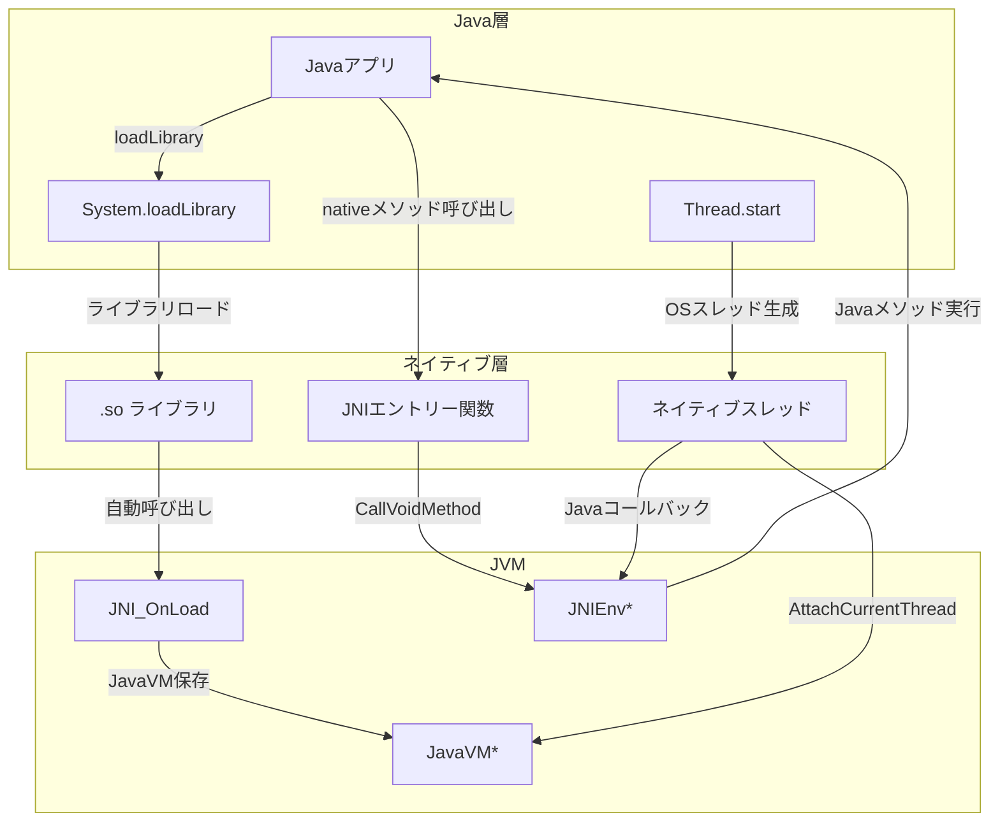
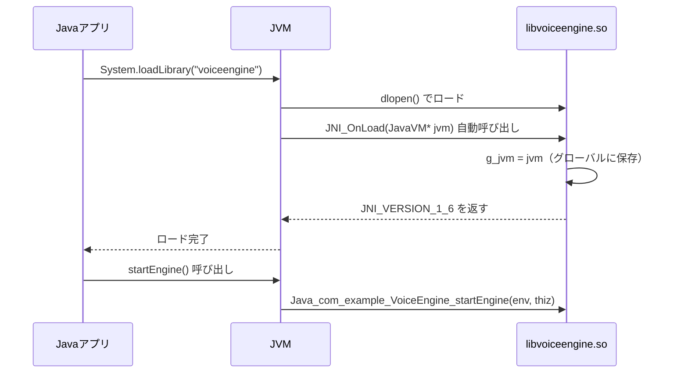
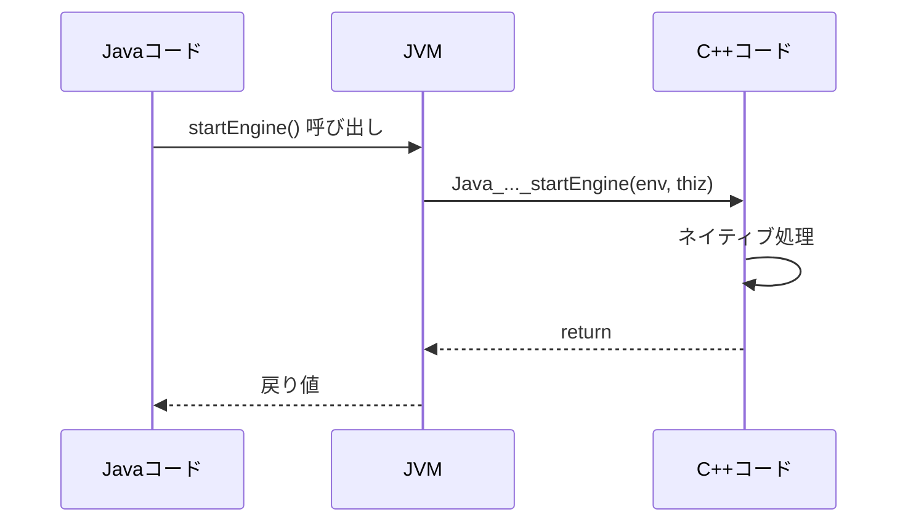
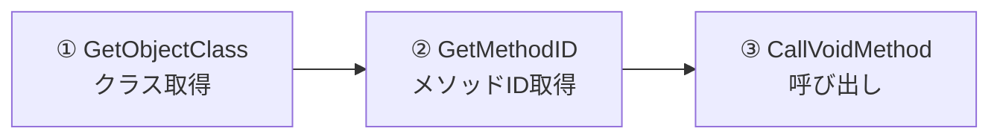
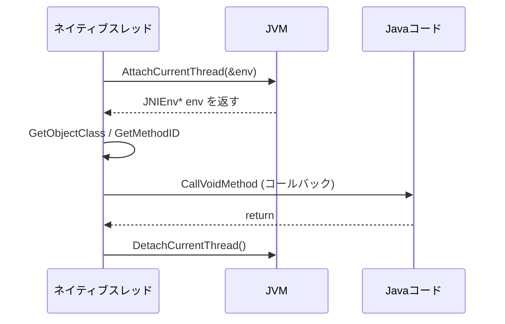
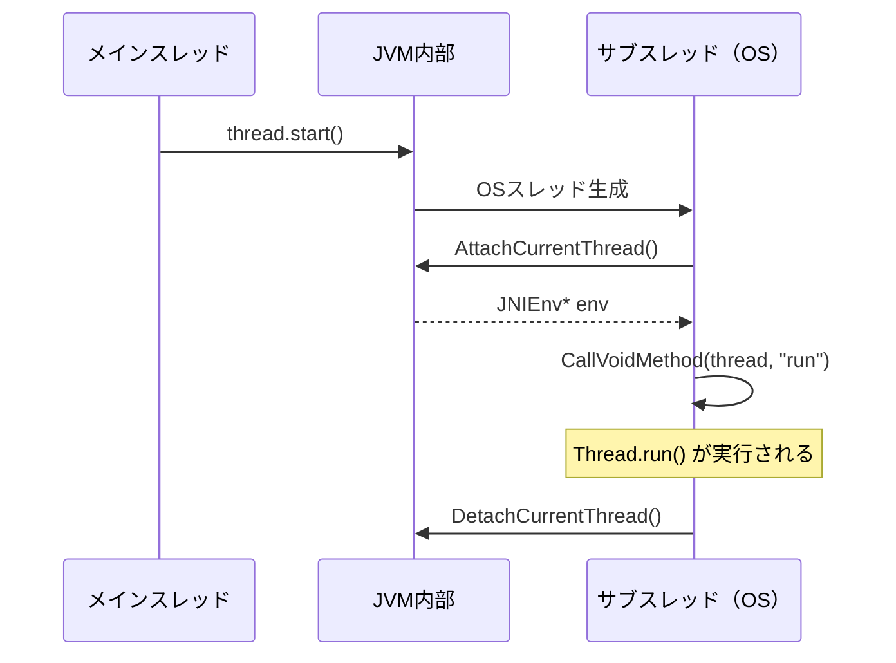

# JNI（Java Native Interface）入門

> C/C++経験者向け：JavaとネイティブコードをつなぐJNIの仕組みを理解する

-----

## 1. JNIとは何か

JNI（Java Native Interface）は、**Javaコードとネイティブコード（C/C++）を相互に呼び出すための標準インターフェース**です。

### なぜJNIが必要か

|用途               |例                  |
|-----------------|-------------------|
|既存のC/C++資産を再利用   |組込みライブラリ、DSPドライバ   |
|パフォーマンスが必要な処理    |音声処理、画像処理          |
|OSやハードウェアへの直接アクセス|HAL、シリアル通信         |
|プラットフォーム固有API    |AndroidのAudioTrack等|

### C言語との対比

```c
// C言語：関数ポインタで他モジュールを呼ぶ
typedef void (*callback_t)(const char* result);
void register_callback(callback_t cb);
```

```java
// Java：JNIでネイティブ層と相互呼び出し
public class VoiceEngine {
    public native void startEngine();   // C++を呼ぶ
    public void onRecognized(String r) { /* C++から呼ばれる */ }
}
```

-----

## 2. 全体アーキテクチャ



-----

## 3. ライブラリロードの流れ

### 3-1. Java側：System.loadLibrary

```java
public class VoiceEngine {
    static {
        // クラスロード時に一度だけ実行
        // "voiceengine" → libvoiceengine.so を探してロード
        System.loadLibrary("voiceengine");
    }

    public native void startEngine();
}
```

### 3-2. ロードから初期化までのシーケンス



### 3-3. C++側：JNI_OnLoad

```cpp
static JavaVM* g_jvm = nullptr;

// .soロード時にJVMから自動的に呼ばれる
JNIEXPORT jint JNICALL JNI_OnLoad(JavaVM* jvm, void* reserved) {
    g_jvm = jvm;  // 後でスレッドから使うために保存
    return JNI_VERSION_1_6;
}

// アンロード時（任意実装）
JNIEXPORT void JNICALL JNI_OnUnload(JavaVM* jvm, void* reserved) {
    // クリーンアップ処理
}
```

### JavaVM と JNIEnv の違い

|       |JavaVM*   |JNIEnv*            |
|-------|----------|-------------------|
|数      |プロセスに1つ   |スレッドごとに1つ          |
|スレッド間共有|✅ OK      |❌ NG               |
|取得タイミング|JNI_OnLoad|AttachCurrentThread|
|主な用途   |スレッドアタッチ  |Javaメソッド呼び出し       |

-----

## 4. 命名ルール

JNIのエントリー関数名には**厳格な命名規則**があります。

### 規則

```
Java_{パッケージ名（_区切り）}_{クラス名}_{メソッド名}
```

### 例

```java
// Javaのパッケージ・クラス・メソッド
package com.example.voice;
public class VoiceEngine {
    public native void startEngine();
    public native String recognize(byte[] audio);
}
```

```cpp
// C++側の対応する関数名
extern "C" {

JNIEXPORT void JNICALL
Java_com_example_voice_VoiceEngine_startEngine(
    JNIEnv* env,   // JNI環境（必須）
    jobject thiz   // thisオブジェクト（必須）
) { ... }

JNIEXPORT jstring JNICALL
Java_com_example_voice_VoiceEngine_recognize(
    JNIEnv* env,
    jobject thiz,
    jbyteArray audio   // Java引数がここに続く
) { ... }

} // extern "C"
```

> **ポイント：** `extern "C"` を忘れると C++ の名前マングリングで関数名が変わり、実行時にクラッシュする。

### メソッドシグネチャ（型記述）

`GetMethodID` の第3引数に使う型記述の書き方です。

```
(引数の型...)戻り値の型
```

|Java型    |記述                  |
|---------|--------------------|
|`void`   |`V`                 |
|`int`    |`I`                 |
|`boolean`|`Z`                 |
|`byte`   |`B`                 |
|`float`  |`F`                 |
|`double` |`D`                 |
|`String` |`Ljava/lang/String;`|
|`int[]`  |`[I`                |

```cpp
// void onRecognized(String result)
"(Ljava/lang/String;)V"

// int calculate(int a, int b)
"(II)I"

// boolean isReady()
"()Z"
```

> **確認方法：** `javap -s -p ClassName.class` でシグネチャを確認できる。

-----

## 5. JavaからC++を呼ぶ（基本呼び出し）



```cpp
extern "C" JNIEXPORT void JNICALL
Java_com_example_VoiceEngine_startEngine(JNIEnv* env, jobject thiz) {

    // C++の処理を書く
    // env経由でJavaのメソッドも呼べる（後述）
}
```

-----

## 6. C++からJavaを呼ぶ（コールバック）

C++側からJavaのメソッドを呼ぶ手順は以下の3ステップです。



### 実装例

**Java側**

```java
public class VoiceEngine {
    // C++から呼ばれるコールバック
    public void onRecognized(String result) {
        Log.d("VoiceEngine", "認識結果: " + result);
    }

    public native void startEngine();
}
```

**C++側**

```cpp
extern "C" JNIEXPORT void JNICALL
Java_com_example_VoiceEngine_startEngine(JNIEnv* env, jobject thiz) {

    // ① クラス取得
    jclass clazz = env->GetObjectClass(thiz);

    // ② メソッドID取得（シグネチャに注意）
    jmethodID mid = env->GetMethodID(
        clazz,
        "onRecognized",
        "(Ljava/lang/String;)V"  // void onRecognized(String)
    );
    if (mid == nullptr) return;  // メソッドが見つからない

    // ③ Java文字列生成して呼び出し
    jstring result = env->NewStringUTF("認識しました");
    env->CallVoidMethod(thiz, mid, result);

    // ④ ローカル参照の解放（重要！）
    env->DeleteLocalRef(result);
    env->DeleteLocalRef(clazz);
}
```

### Call***Methodの使い分け

|戻り値型     |インスタンスメソッド         |staticメソッド               |
|---------|-------------------|-------------------------|
|`void`   |`CallVoidMethod`   |`CallStaticVoidMethod`   |
|`int`    |`CallIntMethod`    |`CallStaticIntMethod`    |
|`boolean`|`CallBooleanMethod`|`CallStaticBooleanMethod`|
|`String`等|`CallObjectMethod` |`CallStaticObjectMethod` |

### 例外チェック（重要）

Java側で例外が起きても、C++側はそのまま続行してしまいます。

```cpp
env->CallVoidMethod(thiz, mid, result);

// Java側で例外が投げられていても、ここは普通に続く
if (env->ExceptionCheck()) {
    env->ExceptionDescribe();  // スタックトレースをログ出力
    env->ExceptionClear();     // クリアしないと次のJNI呼び出しがクラッシュ
    // エラー処理
    return;
}
```

-----

## 7. 別スレッドからJavaを呼ぶ

ネイティブスレッドからJavaを呼ぶ場合は、**JVMへのアタッチ**が必要です。

### なぜアタッチが必要か

JNIエントリー関数（`Java_...`）はJVMが管理するスレッドから呼ばれるため、`JNIEnv*` が自動的に渡されます。しかし **ネイティブで生成したスレッドはJVMの管理外** なため、自分でアタッチして `JNIEnv*` を取得する必要があります。



### 実装例

```cpp
// グローバル参照（スレッドをまたいで使う）
static JavaVM* g_jvm = nullptr;
static jobject g_engine_obj = nullptr;  // グローバル参照として保持

JNIEXPORT jint JNICALL JNI_OnLoad(JavaVM* jvm, void* reserved) {
    g_jvm = jvm;
    return JNI_VERSION_1_6;
}

// Javaオブジェクト参照をグローバル参照として保存
extern "C" JNIEXPORT void JNICALL
Java_com_example_VoiceEngine_startEngine(JNIEnv* env, jobject thiz) {

    // グローバル参照を作成（ローカル参照はスレッドをまたげない）
    g_engine_obj = env->NewGlobalRef(thiz);

    // ネイティブスレッドを起動
    std::thread([]() {
        callbackFromNativeThread();
    }).detach();
}

// ネイティブスレッドからJavaを呼ぶ
void callbackFromNativeThread() {
    JNIEnv* env = nullptr;

    // ① JVMにアタッチ
    jint result = g_jvm->AttachCurrentThread(&env, nullptr);
    if (result != JNI_OK) return;

    // ② 通常通り呼び出し
    jclass clazz = env->GetObjectClass(g_engine_obj);
    jmethodID mid = env->GetMethodID(
        clazz, "onRecognized", "(Ljava/lang/String;)V");

    jstring str = env->NewStringUTF("スレッドからのコールバック");
    env->CallVoidMethod(g_engine_obj, mid, str);

    // ③ ローカル参照解放
    env->DeleteLocalRef(str);
    env->DeleteLocalRef(clazz);

    // ④ 必ずデタッチ（忘れるとリーク）
    g_jvm->DetachCurrentThread();
}

// 終了時にグローバル参照を解放
void cleanup(JNIEnv* env) {
    if (g_engine_obj != nullptr) {
        env->DeleteGlobalRef(g_engine_obj);
        g_engine_obj = nullptr;
    }
}
```

### ローカル参照 vs グローバル参照

|       |ローカル参照            |グローバル参照            |
|-------|------------------|-------------------|
|生存期間   |JNI呼び出し中のみ        |明示的に解放するまで         |
|スレッド間共有|❌ NG              |✅ OK               |
|作成方法   |JNIが自動生成          |`NewGlobalRef()`   |
|解放方法   |`DeleteLocalRef()`|`DeleteGlobalRef()`|
|用途     |一時的な参照            |スレッド間・長期保持         |

-----

## 8. Javaスレッドの内部構造（補足）

`Thread.start()` を呼ぶと、JVM内部でもJNIが使われています。



> `run()` を直接呼ぶとメインスレッドで実行されてしまう理由が、この構造から理解できます。

-----

## 9. まとめ：設計チェックリスト

```
□ extern "C" でマングリングを防いでいるか
□ JNI_OnLoad で JavaVM* を保存しているか
□ JNIEnv* をスレッド間で共有していないか
□ ネイティブスレッドで AttachCurrentThread しているか
□ DetachCurrentThread を忘れていないか
□ ローカル参照を DeleteLocalRef で解放しているか
□ 長期保持するオブジェクトを NewGlobalRef にしているか
□ CallVoidMethod 後に ExceptionCheck しているか
□ メソッドシグネチャの記述は正しいか（javap -s で確認）
```

-----

## 参考：よく使うJNI関数一覧

|カテゴリ|関数                   |用途              |
|----|---------------------|----------------|
|クラス |`GetObjectClass`     |オブジェクトからクラス取得   |
|クラス |`FindClass`          |名前からクラス取得       |
|メソッド|`GetMethodID`        |インスタンスメソッドID取得  |
|メソッド|`GetStaticMethodID`  |staticメソッドID取得  |
|呼び出し|`CallVoidMethod`     |voidメソッド呼び出し    |
|呼び出し|`CallObjectMethod`   |オブジェクト返却メソッド呼び出し|
|文字列 |`NewStringUTF`       |C文字列→jstring変換  |
|文字列 |`GetStringUTFChars`  |jstring→C文字列変換  |
|参照  |`NewGlobalRef`       |グローバル参照作成       |
|参照  |`DeleteGlobalRef`    |グローバル参照解放       |
|参照  |`DeleteLocalRef`     |ローカル参照解放        |
|例外  |`ExceptionCheck`     |例外発生確認          |
|例外  |`ExceptionClear`     |例外クリア           |
|スレッド|`AttachCurrentThread`|スレッドをJVMにアタッチ   |
|スレッド|`DetachCurrentThread`|スレッドをJVMからデタッチ  |
